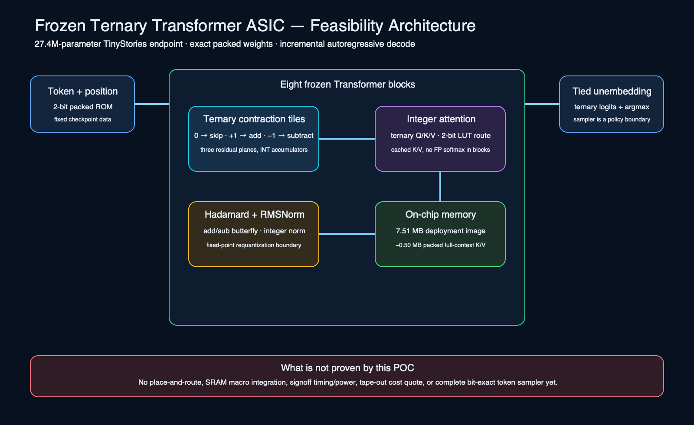

# Frozen ternary Transformer hardware proof of concept

This directory turns a published `ternary-deployment-v2` checkpoint into:

- fixed-weight ternary RTL using actual checkpoint codes;
- matched programmable ternary and INT8 RTL baselines;
- Icarus Verilog functional verification;
- Yosys/ABC pre-layout mapping against Nangate45;
- model-wide workload, memory, bandwidth, energy, and cost scenarios;
- an exact SVG architecture diagram.

The report deliberately separates measurements from assumptions. It does not claim
place-and-route timing, signoff power, or tape-out readiness.



## Reproduce

Download the published 7.51 MB deployment artifact:

```bash
mkdir -p artifacts/hardware-poc/source
hf download sanjuhs/ternary-llm-experiment \
  tinystories-28m/runs/strict-contract-relu-rmsnorm/model-2bit.pt \
  --local-dir artifacts/hardware-poc/source
```

Install open-source simulation/synthesis tools and fetch the pinned cell library:

```bash
brew install yosys icarus-verilog
hardware/scripts/fetch_nangate45.sh
```

Generate and verify everything:

```bash
uv run ternary-hardware-poc \
  --artifact artifacts/hardware-poc/source/model-2bit.pt \
  --output-dir hardware/generated \
  --liberty hardware/lib/NangateOpenCellLibrary_typical.lib
```

The generated `hardware/generated/reports/REPORT.md` is the main result.
